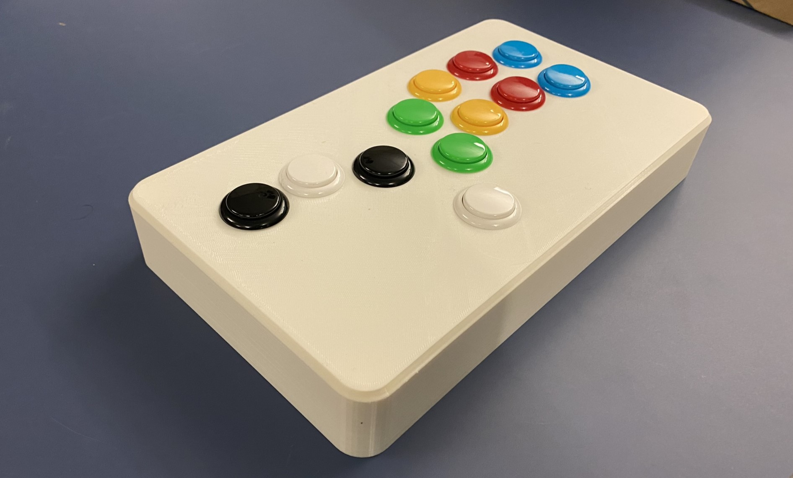
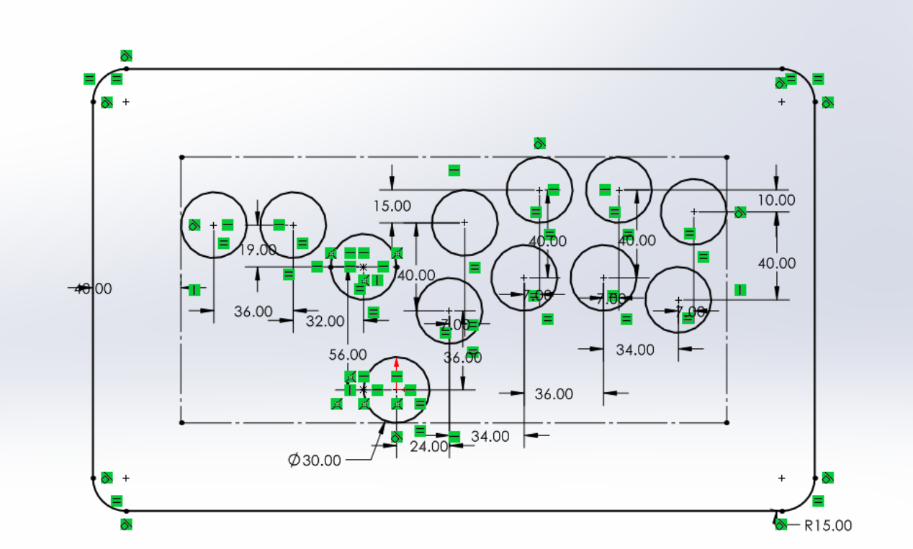
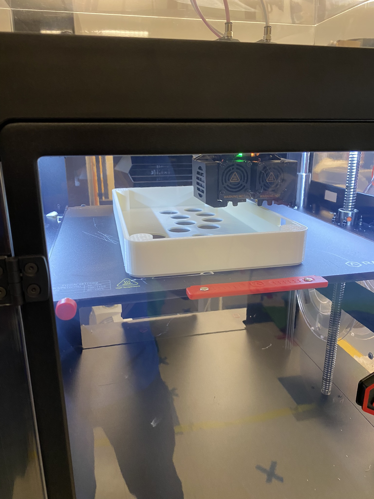
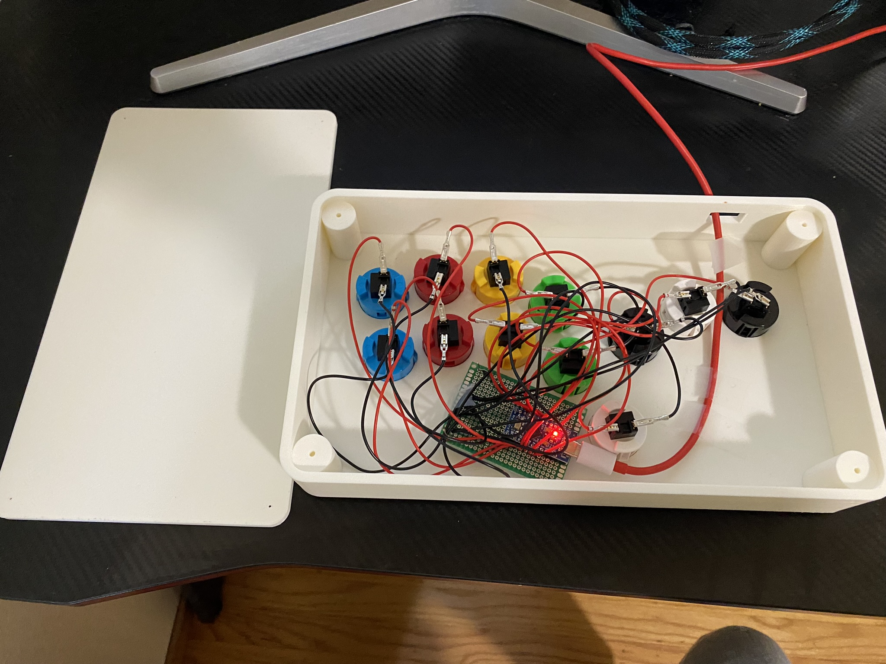
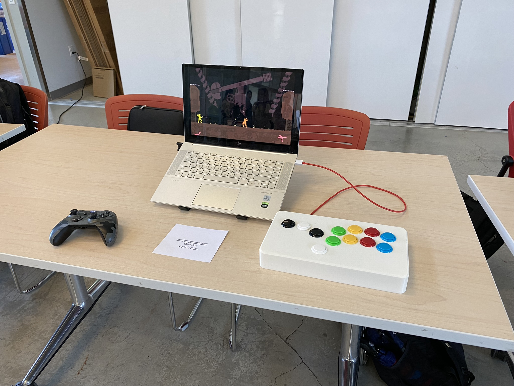
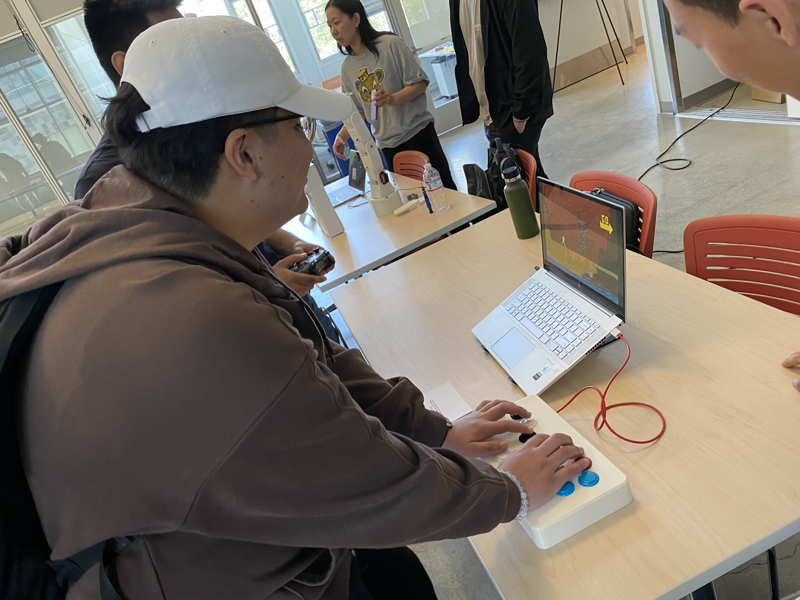

# BearBox
## Custom Leverless Fighting Game Controller
 **Designed and built by Archit Das**

# Specifications
* 12x 30mm Sanwa Buttons
* 1x Arduino Micro Pro controller (ATmega32U4 chip)
* 3D printed PLA shell and lid

# Prototyping and Dimensions

All files provided as SLDPRT files.

# Build Process

|  |  |
| :---: | :---: |
|  |  |

# Showcase!

|  |  |
| :---: | :---: |
|  |  |

